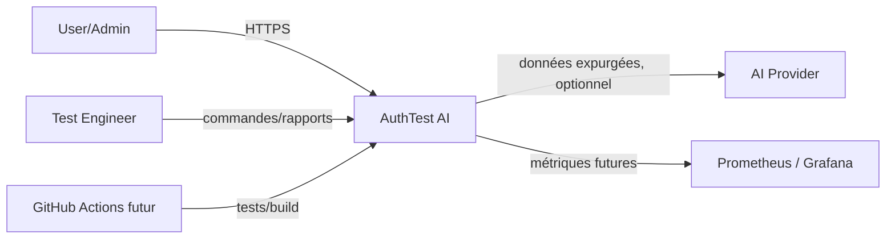
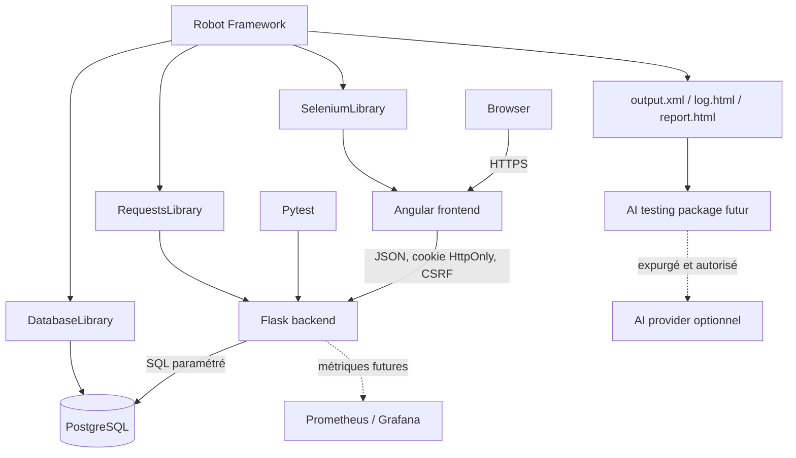
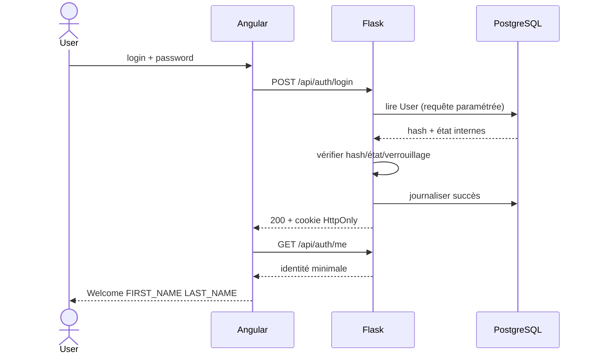
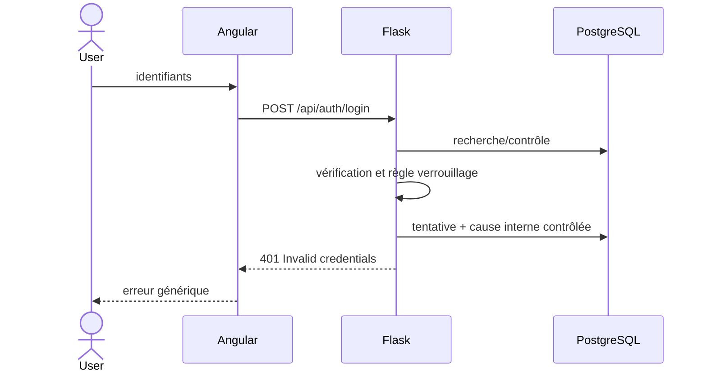
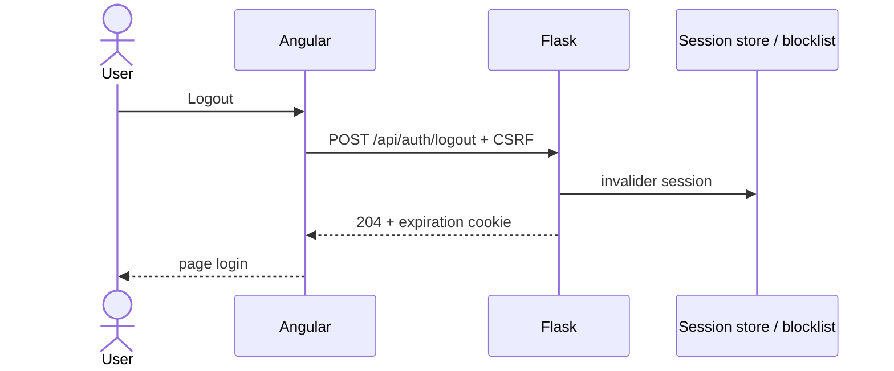
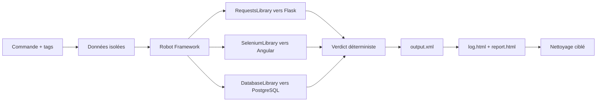
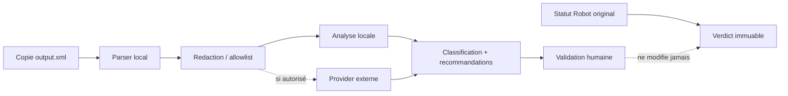
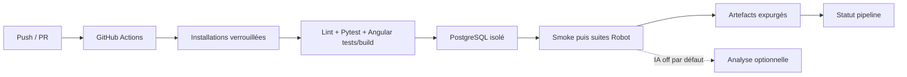

# Architecture initiale

```text
auth-test-ai/
├── frontend/          # Application Angular standalone
├── backend/           # API Flask et persistance PostgreSQL 17
├── robot-tests/       # Suites API, UI, base, sécurité et smoke
├── ai-testing/        # Future analyse complémentaire et anonymisée
├── docs/              # Architecture, décisions et preuves de livraison
├── infra/             # Future observabilité et configuration infrastructure
└── .github/workflows/ # Futurs pipelines CI
```

Le frontend est le système web visible. Le backend expose les API métier et
est responsable de la persistance applicative et des sessions serveur. PostgreSQL 17 est lancé localement avec Docker
Compose. Robot Framework couvre les parcours transverses ; Pytest couvre la
logique backend. La couche IA restera indépendante des résultats déterministes.

## Diagramme de contexte



## Diagramme de conteneurs



## Flux de connexion



## Flux de refus de connexion



## Flux de logout



## Flux Robot Framework



## Flux d’analyse IA futur



## Flux CI/CD futur



## Frontières de confiance et flux sensibles

Les frontières sont navigateur/API, API/DB, runners CI/secrets, artefacts/lecteurs et package IA/provider. Login/password traverse uniquement HTTPS vers Flask; le password est vérifié puis abandonné, jamais logué. Cookies et CSRF restent hors logs/captures. Réponses DB, journaux et XML sont non fiables lorsqu’ils deviennent des entrées de rapport ou d’IA. Toute sortie vers un provider exige accord, redaction locale et minimisation. PostgreSQL applicatif et résultats de test sont séparés logiquement; les accès CI suivent le moindre privilège.

Le cookie navigateur contient uniquement un identifiant de session opaque. Les données de session sont conservées dans la table PostgreSQL `server_sessions`; elles expirent après 30 minutes d’inactivité et au plus tard après 8 heures. Prometheus/Grafana, GitHub Actions et le provider IA sont futurs et ne sont pas des dépendances du fonctionnement classique.
