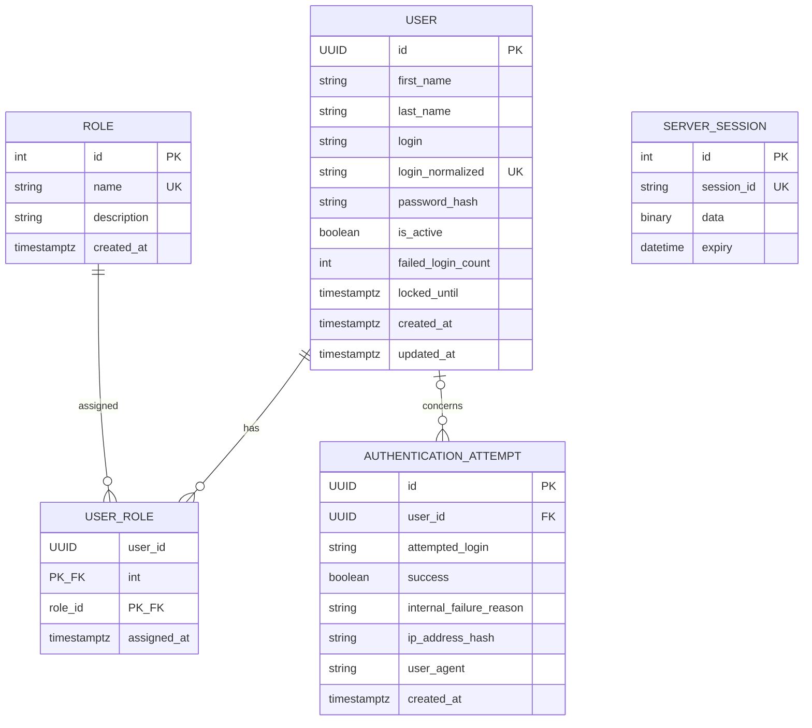

# Modèle de données backend — semaine 2

Le modèle accepté utilise PostgreSQL 17 et SQLAlchemy 2 typé. La migration initiale est réversible. Aucun mot de passe en clair, cookie, identifiant de session ou jeton CSRF n’est journalisé.

## Contraintes et index

- `users.login_normalized` est unique et indexé; sa valeur est `trim + NFKC + casefold`. Le login d’affichage est conservé séparément.
- `password_hash` contient exclusivement un hash Argon2id et n’appartient à aucune sérialisation publique.
- `failed_login_count >= 0`; le seuil est 5 et `locked_until` expire après 15 minutes.
- `user_roles` possède une clé primaire composée et des cascades uniquement vers la table d’association.
- `authentication_attempts.user_id` est nullable avec `ON DELETE SET NULL`; les index couvrent date, utilisateur/date et succès/date.
- Les longueurs maximales sont 100 pour noms/login, 32 pour rôle/cause, 255 pour description et user-agent, 64 pour le HMAC SHA-256 de l’IP.

## Sessions serveur

Flask-Session utilise `server_sessions`. Le navigateur reçoit uniquement un identifiant opaque dans un cookie `HttpOnly`, `SameSite=Lax`, `Secure` en production. `user_id`, `issued_at`, `last_activity_at` et le secret CSRF restent côté serveur; aucun `password_hash` n’y est stocké. Une session est refusée après 30 minutes d’inactivité ou 8 heures absolues. La désactivation est vérifiée à chaque requête authentifiée, ce qui invalide fonctionnellement toute session encore présente.

## Audit et sensibilité

Les causes internes autorisées sont `SUCCESS`, `UNKNOWN_LOGIN`, `INVALID_PASSWORD`, `ACCOUNT_INACTIVE`, `ACCOUNT_LOCKED` et `RATE_LIMITED`; elles ne sont jamais exposées au client. L’IP est pseudonymisée par HMAC-SHA-256 et le user-agent tronqué à 255 caractères. Les données de test sont synthétiques et isolées dans `auth_test_ai_test`; aucun volume Docker n’est supprimé par la suite.
