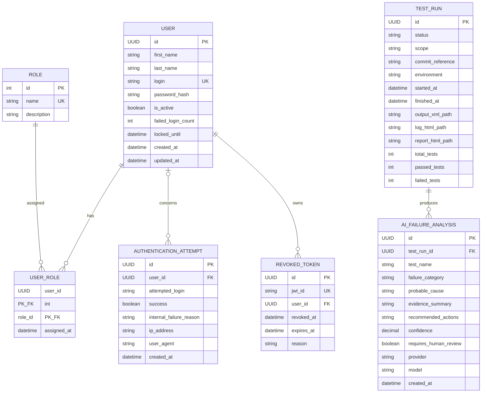

# Modèle de données conceptuel

Ce modèle est une proposition de semaine 1, sans migration. Aucun mot de passe en clair n’est stocké.

## Relations, clés et contraintes

- `UserRole` matérialise le N–N User/Role; PK composée (`user_id`, `role_id`), FKs non nulles, `assigned_at` non nul. `Role.name`, `User.login` et `RevokedToken.jwt_id` sont uniques.
- Toutes les PK sont non nulles. Les timestamps de création, booléens et compteurs sont non nuls; `failed_login_count >= 0`. `locked_until`, `AuthenticationAttempt.user_id`, dates de fin et champs de rapports avant achèvement peuvent être nuls.
- `AuthenticationAttempt.user_id` est nullable pour éviter l’énumération et journaliser un login inconnu. `attempted_login` est minimisé/pseudonymisé selon la politique à confirmer.
- `AiFailureAnalysis.test_run_id` référence un `TestRun`; chaque analyse reste en revue jusqu’à décision humaine. `confidence` est bornée de 0 à 1.
- Index proposés : `User(login)`, `User(is_active, locked_until)`, `UserRole(role_id)`, `AuthenticationAttempt(created_at)`, `(user_id, created_at)`, hash/représentation protégée de `(attempted_login, created_at)`, `RevokedToken(jwt_id, expires_at)`, `TestRun(commit_reference, started_at)`, `AiFailureAnalysis(test_run_id)`.

## Sensibilité et cycle de vie

- Très sensibles : `password_hash`, `jwt_id`, IP, login tenté, user-agent, causes internes et preuves d’échec. Le hash n’est jamais retourné; le JWT/cookie, mot de passe, clé, token CSRF et contenu brut de prompt ne sont jamais journalisés.
- Chiffrer les transports; restreindre DB et sauvegardes au moindre privilège. Envisager anonymisation/troncature IP et hachage avec sel secret du login tenté, après validation juridique/KPIT.
- Rétentions à confirmer : supprimer/agréger les tentatives et analyses à échéance; purger les blocklists après expiration si aucune obligation d’audit; préserver uniquement les métadonnées nécessaires. Une demande de suppression doit respecter intégrité/audit et produire anonymisation si suppression directe impossible.
- Les données de test sont synthétiques, identifiables, dans base/schema dédié et nettoyées par procédures non destructives ciblées. Jamais de copie de production.
- PostgreSQL applicatif contient User/Role/audit/blocklist. Les résultats `TestRun`/`AiFailureAnalysis` appartiennent au domaine testing (stockage ou schéma séparé); les chemins pointent vers des artefacts protégés, jamais vers des secrets.
