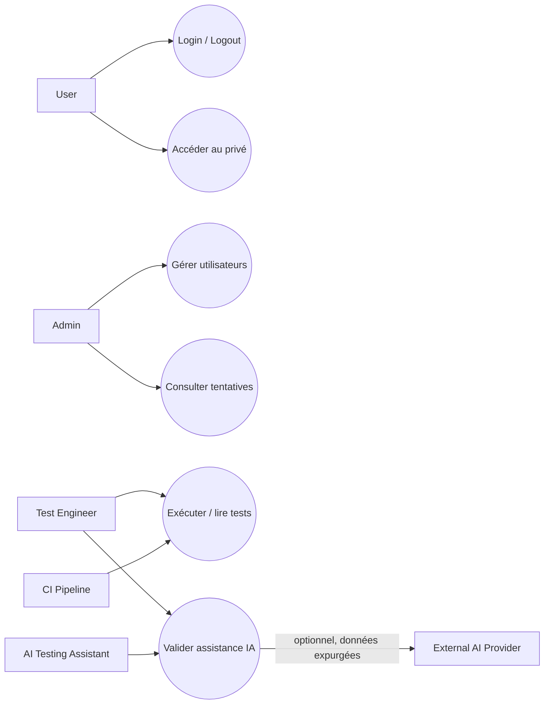

# Cas d’utilisation

Acteurs : **User**, **Admin**, **Test Engineer**, **CI Pipeline**, **AI Testing Assistant** et, uniquement si autorisé, **External AI Provider** (acteur technique optionnel).

Chaque cas est **Designed**, non implémenté sauf mention dans la matrice.

| ID | Objectif; acteurs | Préconditions; déclencheur | Scénario nominal | Alternatives / erreurs | Postconditions | Exigences; tests envisagés |
|---|---|---|---|---|---|---|
| UC-AUTH-001 | Connecter un compte; User | Compte actif; soumission valide | Valider, vérifier hash, auditer, créer session | Invalide/verrouillé/DB indisponible : refus générique | Session valide, accueil autorisé | FR-AUTH-003/005/009, FR-AUDIT-001; UT-AUTH-003, API-AUTH-001, UI-AUTH-005 |
| UC-AUTH-002 | Refuser une connexion; User | Formulaire; identifiants non valides | Réponse uniforme et audit interne | Entrée absente 400; stockage audit selon politique | Aucune session | FR-AUTH-003/004/006/007/008/013; API-AUTH-002..004/008 |
| UC-AUTH-003 | Limiter essais; User | Politique validée; seuil atteint | Verrouiller jusqu’à date | Horloge/stockage en erreur : comportement sûr | Tentatives refusées/auditées | FR-AUTH-014/015; UT-AUTH-006/007, SEC-AUTH-006 |
| UC-AUTH-004 | Se déconnecter; User | Session; clic logout | CSRF, invalidation, expiration cookie | Déjà expirée : idempotent | Session inutilisable | FR-AUTH-010/016; API-AUTH-005, UI-AUTH-006 |
| UC-AUTH-005 | Accéder route protégée; User | Requête privée | Valider session et droits | Absente/expirée/modifiée : 401; droit insuffisant 403 | Données seulement si autorisé | FR-AUTH-011/016/017; API-AUTH-006, SEC-AUTH-004/007/008 |
| UC-AUTH-006 | Récupérer utilisateur courant; User | Session valide; GET `/me` | Retourner identité minimale | Session invalide 401 | Aucun secret exposé | FR-AUTH-009/011/012; API-AUTH-007 |
| UC-ADMIN-001 | Lister utilisateurs; Admin | Rôle Admin; demande | Autoriser, filtrer, paginer | 401/403; filtre invalide 400 | Liste sans hash | FR-ADMIN-001/005/006; API-ADMIN-001/005 |
| UC-ADMIN-002 | Créer utilisateur; Admin | Admin; payload valide | Valider, hasher, créer | Doublon 409; faible/incorrect 400 | Compte persistant | FR-ADMIN-002/006; API-ADMIN-002, DB-ADMIN-001 |
| UC-ADMIN-003 | Activer/désactiver; Admin | Admin et cible; PATCH | Changer état | 404; protection dernier Admin à confirmer | État auditable | FR-ADMIN-003/004/006; API-ADMIN-003/004 |
| UC-ADMIN-004 | Voir tentatives; Admin | Admin; critères | Retourner page minimisée | 401/403/400 | Aucun secret/cause dangereuse | FR-AUDIT-003, FR-ADMIN-006; API-AUDIT-001, SEC-AUDIT-001 |
| UC-TEST-001 | Lancer smoke; Test Engineer/CI | Workspace prêt; commande/tag | Exécuter cas critiques courts | Prérequis absent : Blocked/Failed explicite | Verdict + 3 artefacts | FR-TEST-001/006/007/008; REG-SMOKE-001 |
| UC-TEST-002 | Lancer régression; Test Engineer/CI | Critères d’entrée; déclenchement | Préparer DB, lancer suites, agréger | Incident infra : suspendre/reprendre | Résultat déterministe | FR-TEST-001..009; REG-AUTH-001 |
| UC-TEST-003 | Consulter rapports; Test Engineer | Run terminé; ouverture | Relier XML/log/report au commit | Artefact absent/corrompu : signaler | Preuve consultable et expurgée | FR-TEST-006/007/008; REG-REPORT-001..003 |
| UC-AI-001 | Générer brouillon; Test Engineer, AI Assistant, Provider optionnel | Autorisation + entrée expurgée | Générer, marquer brouillon | Provider absent : aucune incidence classique | Brouillon non officiel | FR-AI-001/005; AI-TEST-001/005 |
| UC-AI-002 | Analyser échec Robot; AI Assistant | `output.xml` copié/expurgé | Extraire preuve, classer, recommander | Injection/incertitude/panne : isoler et signaler | Rapport séparé; verdict intact | FR-AI-002/003/004/006; AI-TEST-002..004/006 |
| UC-AI-003 | Valider recommandation; Test Engineer | Sortie IA en attente; revue | Vérifier preuve puis accepter/rejeter | Pas de validation : reste brouillon | Décision humaine tracée | FR-AI-005/006; AI-TEST-005/006 |
